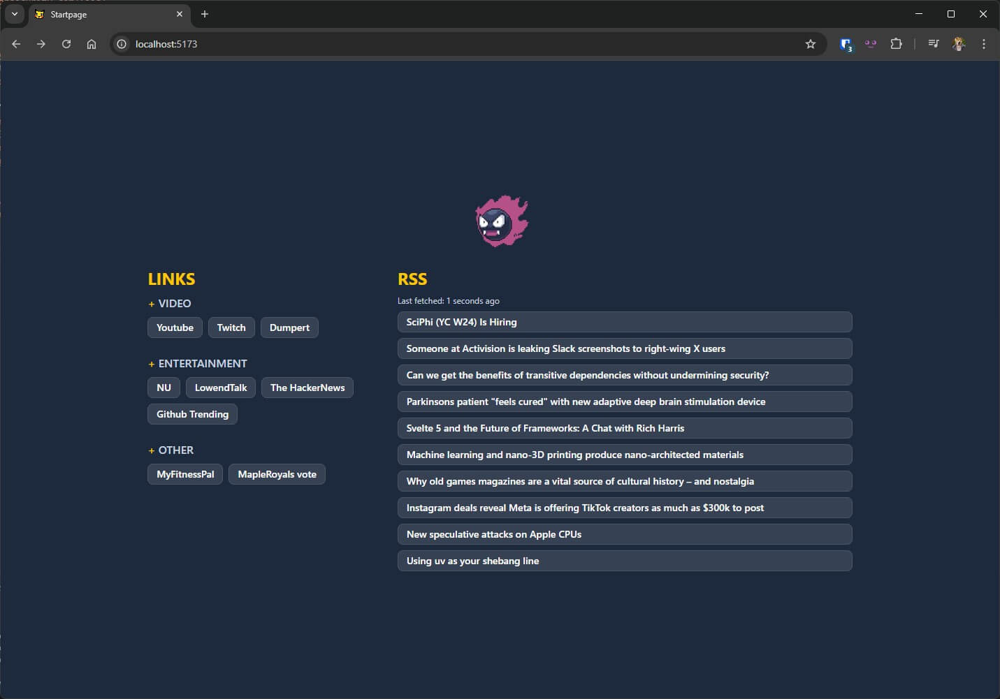

# Quinten's Startpage v3
For anyone that finds this useful or likes to geek out. This repo is a second of rewrite of [my old](https://github.com/Quintenps/Startpagev2) and [older startpage](https://github.com/Quintenps/Startpage).

## Features
- Automatic light and dark theme
- RSS Reader and cached results (15 minutes)
- Svelte with Cloudflare adapter to deploy to Cloudflare pages

## Installation
- Configure StartPageConfig.ts
- Deploy using Cloudflare's webui or using wrangler

## Preview

